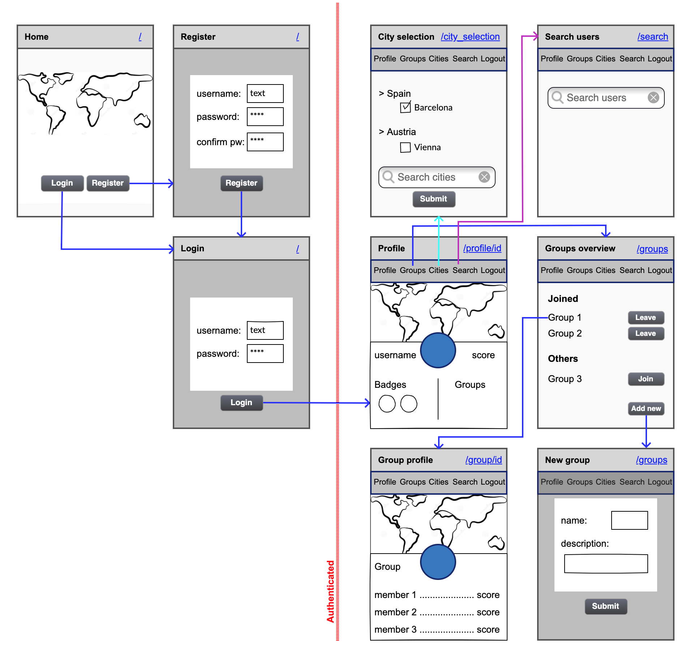

###  General Assembly, Software Engineering Immersive
# TripBit

## Overview

This is the final project of the software engineering immersive course at GA London. The assignment was to create a **full-stack application** within **one week**, and we chose to complete it in a **team of four**.

TripBit is a platform inspired by analogue scratch maps, where people scratch out the countries they have visited. Users are assigned a travel score and can earn badges for certain achievements. They can also create and join groups to compare their travels with friends more directly.

You can launch the app on Heroku [here](https://tripbit.herokuapp.com/), or find the GitHub repo [here](https://github.com/katheich/tripbit).

## Brief

* Choose to work solo or in a team
* **Build a full-stack application** by making your own backend and your own front-end
* **Use a Python Django API** using Django REST Framework to serve your data from a Postgres database
* **Consume your API with a separate front-end** built with React
* **Be a complete product** which most likely means multiple relationships and CRUD functionality for at least a couple of models
* **Implement thoughtful user stories/wireframes** that are significant enough to help you know which features are core MVP and which you can cut
* **Have a visually impressive design** to kick your portfolio up a notch and have something to wow future clients & employers. 
* **Be deployed online** so it's publicly accessible.


## Technologies used
- HTML
- SCSS
- Python
- Django
- PostgreSQL
- JavaScript (ES6)
- React.js
- React Map GL (Mapbox)
- FileStack API
- React Toastify
- Webpack
- Dotenv
- Heroku
- Git and GitHub
- Trello
- Bulma
- Google Fonts

## Approach

### Planning

- On the first day we came up with the idea of the app and the wireframes for the main pages.


- We also planned out the models and end points that we would need on the back-end and divided the tasks among us using Trello.


### Back-end

**Models**

- For the PostgreSQL database, we set up four tables: Users, Towns, Badges and Groups.

- For the users, we extended the basic User provided by Django to include the following extra fields: email, profile image (with a default so it was not necessary to register), score (starting at the default of 0), dexterity (determining whether the navbar is located on the right or left-hand side of the screen), first and last name.

  ```py
  class User(AbstractUser):

    ORIENTATION = (
        ('LH', 'Left-Handed'),
        ('RH', 'Right-Handed'),
    )

    email = models.CharField(max_length=50, unique=True)
    image = models.CharField(max_length=500, default='https://bit.ly/37UONby')
    score = models.IntegerField(default=0)
    dexterity = models.CharField(max_length=2, choices=ORIENTATION, default='RH')
    first_name = models.CharField(max_length=100)
    last_name = models.CharField(max_length=100)
  ```

- For the towns, we relied on the World Cities Database provided by Simplemaps, and so used the same fields as were available in that dataset. 

  - We reduced the dataset by considering only towns with more than 80,000 inhabitants. We then read the resulting .csv file into our PostgreSQL database using the terminal (as shown below). Once the data was read in, we created a fixtures.json file that would allow for more easily re-seeding the database in the format we needed.

  ```py
  python manage.py shell

    import csv
    from travels.models import Town

    with open('./travels/db/worldcities_clean.csv') as csvfile:
      reader = csv.reader(csvfile, delimiter=";")
      for row in reader:
        p = Town(name = row[0], name_ascii = row[1], lat = row[2], lng = row[3], country = row[4], iso2 = row[5], iso3 = row[6], admin_name = row[7], capital = row[8], population = row[9], continent=row[11])
        p.save()
  ```
    - In addition to the info provided by the database, the towns also had a **many-to-many** relationship to users, showing the visitors that have been to each town.

  ```py
  class Town(models.Model):
    name = models.CharField(max_length=255)
    name_ascii = models.CharField(max_length=255)
    lat = models.CharField(max_length=255)
    lng = models.CharField(max_length=255)
    country = models.CharField(max_length=255)
    iso2 = models.CharField(max_length=255, null=True)
    iso3 = models.CharField(max_length=255, null=True)
    admin_name = models.CharField(max_length=255, null=True)
    capital = models.CharField(max_length=255, null=True)
    population = models.IntegerField(null=True)
    continent = models.CharField(max_length=255)
    visitors = models.ManyToManyField(
        User,
        related_name='towns',
        blank=True
    )

    def __str__(self):
        return f'{self.name} - {self.country}'
  ```

- For the badges, we similarly created a csv file outlining the names, descriptions and links to the images that we wanted to use, that was then read into the database via the terminal the same way as the towns data and eventually added to the fixtures file. Additionally, the badges also have a **many-to-many** relationship to users, showing all the users that have earned a given badge.

  ```py
  class Badge(models.Model):
    name = models.CharField(max_length=50)
    description = models.CharField(max_length=300)
    image = models.CharField(max_length=100)
    users = models.ManyToManyField(
        User,
        related_name='badges',
        blank=True
    )

    def __str__(self):
        return f'{self.name}'
  ```

- For the groups, we only needed the basic fields of name, description and image, plus the following relationships to the User model: 1) a **one-to-many** relationship signifying the owner of the group, 2) a **many-to-many** relationship tracking the members of each group, and 3) another **many-to-many** relationship tracking the users that have requested membership of a group but have not yet been approved by the owner.

  ```py
  class Group(models.Model):

    name = models.CharField(max_length=50)
    description = models.CharField(max_length=300)
    image = models.CharField(max_length=500, default='https://cdn.pixabay.com/photo/2014/04/02/10/47/globe-304586_1280.png')
    owner = models.ForeignKey(
        User,
        related_name='groups_owned',
        on_delete=models.CASCADE,
        default=1
    )
    members = models.ManyToManyField(
        User,
        related_name='groups_joined',
        blank=True
    )
    requests = models.ManyToManyField(
        User,
        related_name='groups_requested',
        blank=True
    )

    def __str__(self):
        return f'{self.name}'
  ```

**API End-points**

#### 1. User

  |           	| GET 	| POST 	| PUT 	| DELETE 	|
  |-----------	|-----	|------	|-----	|--------	|
  | /register 	|     	|   x  	|     	|        	|
  | /login    	|     	|   x  	|     	|        	|
  | /users   	  |  x  	|    	|  	|      	|
  | /profile/\<int:pk>/   	|  x  	|    	|  	|     	|
  | /profile   	|  x  	|   	|  x  	|    x   	|
  | /profile/edit/all   	|   	|    	|  x  	|      	|

- `/register` only has a post route, where the user's data is received and stored in the database.
- Similarly, `/login` only has a post route, where the user's login information is received, checked and, if valid, a JWT token is returned as response.
- `/users` is a simple GET route, that provides a full list of users to allow searching for other users to access their profiles.
- `/profile/<int:pk>/` similarly only has a GET route to fetch a specific user profile to be displayed.
- `/profile` has a GET, PUT and DELETE route, all relating to the user data of the user currently logged in, allowing them to respectively fetch, amend and delete their profile information.
- `/profile/edit/all` is the most complex part of the platform, even though it only involves a PUT route. This is the route via which a user add towns that they have visited to their profile, setting off a chain-reaction:
  - The route is set up to always receive the full list of towns a given user has visited. These town are added to the user in the database.
  - Given this list of towns, the badges that the user has earned are determined. This is done via bespoke functions for each type of badge in the database, for instance the 'Columbus badge' (with ID 209 in the database) is determined as follows:

    ```py
    # Columbus (209)
    if 'Portugal' in unique_user_countries and 'Spain' in unique_user_countries and 'South America' in unique_continents:
        badge_ids.append(209)
    ```
  - Once this individual user's new badges have been allocated, the badges that rely on comparing information across users are re-assessed: checking which user has visited the most cities, countries, continents and earned the most badges. These users are saved to the badges directly.
  - Following this, the user score is determined, adding 5 XP per town, 10 XP per capital, 20 XP per country and 50 XP per continent visited.
  - All of this new information is added to the user profile, which is then finally saved in the database.


#### 2. Town

  |                      	| GET 	| POST 	| PUT 	| DELETE 	|
  |----------------------	|-----	|------	|-----	|--------	|
  | /towns         	|  x  	|    	|     	|        	|

- `/towns` only has a GET route, since the town data is only displayed and never amended directly. It was a conscious choice to have users only add towns they have visited via the `/profile/edit/all` route outlined above, in order to ensure that all the other information that depended on the list of towns would always be updated correctly.

#### 3. Badge

  |                      	| GET 	| POST 	| PUT 	| DELETE 	|
  |----------------------	|-----	|------	|-----	|--------	|
  | /badges          	|  x  	|    	|     	|        	|
  | /badges/\<int:pk> 	|  x  	|      	|     	|        	|

- `/badges` and `/badges/<int:pk>` similarly only involve simple GET routes, allowing the display of all badges, as well as of one specific badge at a time,since the badge information itself is immutable in our database and badges are allocated to users via the `/profile/edit/all` route outlined above. In fact, we did not end up using these routes at all.

#### 4. Group

  |                      	| GET 	| POST 	| PUT 	| DELETE 	|
  |----------------------	|-----	|------	|-----	|--------	|
  | /groups           	|  x  	|   x  	|     	|        	|
  | /groups/\<int:pk> 	|  x  	|      	|  x   	|     x   	|
  | /groups/\<int:pk>/membership       	|  x  	|      	|  x  	|    x   	|

- `/groups` has both a GET and a POST route, the former allowing to see all group information in the database and the latter allowing the posting of a new group to the platform.
- `/groups/<int:pk>` has a publicly accessible GET route, allowing the info of a specific group to be displayed. It also has a PUT and DELETE route, which allow the owner of the group to amend and delete the group information from the platform respectively.
- `/groups/<int:pk>/membership` similarly has a GET, PUT and DELETE route, which do the following:
  - The GET route allows any user not affiliated with the group to request membership of the group. This will add the user to the 'requests' field of the Group model.
  - The PUT route allows the owner of the group to specify the ID of one of the user's in the list of requests, which will approve that user's membership and move them to the 'members' field of the group.
  - The DELETE route allows a member to remove themselves from the group, or the owner of the group to remove a specific member from the group, again by specifying the ID of the member to be removed.

### Front-end

*** coming soon ***


### Complete final file structure

*** coming soon ***


## Screenshots

*** coming soon ***


## Potential future features

*** coming soon ***


## Bugs 

*** coming soon ***


## Lessons learned

*** coming soon ***

## Artwork and credit

[World Cities Database](https://simplemaps.com/data/world-cities) provided by Simplemaps

[React Map GL](https://uber.github.io/react-map-gl/#/) by Uber

[React Toastify](https://github.com/fkhadra/react-toastify)